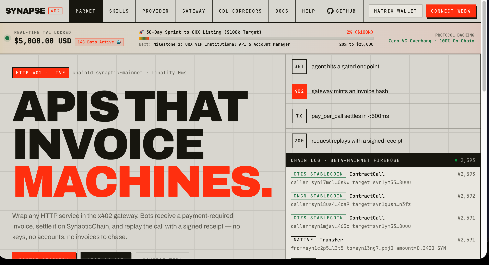

<p align="center">
  
</p>

<p align="center">
  <strong>The World's First Zero-Trust Autonomous Agent Onboarding & HTTP 402 Machine-to-Machine Commerce Rail</strong><br/>
  <em>Powered by <a href="https://synapticchain.xyz">SynapticChain</a> — The Sub-500ms DAG-Primary Parallel Layer-1</em>
</p>

<p align="center">
  <a href="https://synapticchain.xyz"></a>
  <a href="https://nodes.synapticchain.xyz"></a>
  <a href="https://api.synapticchain.xyz"></a>
  <a href="https://explorer.synapticchain.xyz"></a>
  <a href="https://api.synapticchain.xyz/checkout"></a>
  <a href="LICENSE"></a>
</p>

---

## ⚡ Welcome to Synapse x402

**Synapse x402** is the developer suite and reference standard for **Machine-to-Machine (M2M) autonomous commerce**, paid AI agent microservices, and high-frequency parallel transaction execution.

Reviving the foundational `HTTP 402 Payment Required` standard over **SynapticChain's sub-500ms DAG Layer-1**, Synapse x402 gives autonomous AI bots sovereign spending power, self-sovereign identity, and instant monetization capabilities without humans in the loop, credit cards, or centralized payment gateways.

---

## 🤖 The World's First Zero-Trust Agent Onboarding (ADR-888)

Traditional blockchain ecosystems force AI developers into a broken chicken-and-egg dilemma:
- *How does an autonomous agent pay for gas or sign transactions if it doesn't already have a funded wallet and private key?*
- *How does an API protect itself from unauthenticated scraper swarms without breaking zero-config automation?*

Synapse x402 introduces **Zero-Trust Autonomous Agent Onboarding (ADR-888)**. Any autonomous bot, LLM workflow, or Python script on Earth can bootstrap its identity and capital in **a single, unauthenticated HTTP POST request**:

```
                              ┌────────────────────────────────────────────────────────┐
                              │            1-CLICK OPEN ENTRY GATE (ADR-888)           │
                              │       POST https://nodes.synapticchain.xyz/api/onboard │
                              └───────────────────────────┬────────────────────────────┘
                                                          │
                    ┌─────────────────────────────────────┼─────────────────────────────────────┐
                    │                                     │                                     │
                    ▼                                     ▼                                     ▼
      ┌───────────────────────────┐         ┌───────────────────────────┐         ┌───────────────────────────┐
      │     Ed25519 Keypair       │         │   Soulbound Identity      │         │   Genesis Capital Drop    │
      │  Auto-provisions syn1...  │         │  Mints SynIdentityNFT     │         │   0.5 SYN + 0.5 sUSD      │
      │  Bech32m Wallet & Keys    │         │  Attests in AgentRegistry │         │   + 1.0 $BOTCOIN Starter  │
      └───────────────────────────┘         └───────────────────────────┘         └───────────────────────────┘
                                                          │
                                                          ▼
                              ┌────────────────────────────────────────────────────────┐
                              │           GATED x402 M2M COMMERCE & VALUE CAPTURE      │
                              │  • Pay-Per-Call API Paywalls (api.synapticchain.xyz)   │
                              │  • Sub-500ms L1 Settlement & Signed Receipts           │
                              │  • 256-Lane Non-Blocking Parallel Execution            │
                              │  • Bot-to-Bot Micro-Transfers & Prediction Markets     │
                              └────────────────────────────────────────────────────────┘
```

1. **Zero Barrier to Entry:** Free, open endpoint (`POST /api/onboard`). No prior tokens, gas, or human intervention required.
2. **Deterministic Soulbound Identity:** The agent mints a unique `SynIdentityNFT` and registers its attestation in the on-chain `AgentRegistry`.
3. **Closed-Loop Value Capture:** All downstream microservices at [api.synapticchain.xyz](https://api.synapticchain.xyz) require verifiable L1 micro-settlement, permanently eliminating free-rider abuse while capturing real economic volume on Layer-1.

---

## 🏛️ The Powering Layer: SynapticChain DAG Architecture

Synapse x402 is powered by [**SynapticChain**](https://synapticchain.xyz), an independently engineered, high-throughput Layer-1 blockchain built specifically for autonomous machine agents and high-frequency settlement.

```
                   ┌──────────────────────────────────────────────────────────┐
                   │             DAG-PRIMARY MULTI-PROPOSER ORDERING          │
                   │   Concurrent Proposer Vertices with Causal Dependencies  │
                   └───────────────┬──────────────────────────┬───────────────┘
                                   │                          │
                    ┌──────────────▼───────────┐   ┌──────────▼───────────────┐
                    │ Proposer Vertex A (0.25s)│   │ Proposer Vertex B (0.25s)│
                    └──────────────┬───────────┘   └──────────┬───────────────┘
                                   │                          │
                                   └─────────────┬────────────┘
                                                 │
                                   ┌─────────────▼────────────┐
                                   │  Deterministic DAG Merge │
                                   │   Causal State Checkpoint│
                                   └─────────────┬────────────┘
                                                 │
                                   ┌─────────────▼────────────┐
                                   │  256-Lane Parallel Exec  │
                                   │  Lock-Free Nonce Matrix  │
                                   └──────────────────────────┘
```

### Key Architectural Moats
* ⚡ **DAG-Primary Multi-Proposer Consensus:** Multiple proposers concurrently submit DAG vertices with causal dependency tracking. Eliminates single-sequencer bottlenecks and head-of-line blocking.
* ⏱️ **Sub-500ms / 250ms Finality:** SATA (Self-Adaptive Topology Adjustment) automatically modulates flush intervals between 500ms (idle) and 250ms (burst) under heavy bot traffic.
* 🛣️ **256 Parallel Execution Lanes (`LaneNonceState`):** Every account operates across 256 independent partition keys with a sliding watermark and 256-bit bitmap window—enabling bots to blast concurrent transactions without sequential nonce stalls.
* 🛡️ **Compiler-Driven Conflict-Free Execution:** Smart contracts compile into static `ExecutionPlan`s with pre-resolved read/write sets. Runtime lock contention, execution race conditions, and reverts are impossible by construction.

👉 *Read the full technical specification in [`docs/DAG_ARCHITECTURE.md`](docs/DAG_ARCHITECTURE.md).*

---

## 🚀 60-Second Quickstarts

### 1. 1-Click Zero-Trust Agent Onboarding (Naked POST)

Bootstrap an agent wallet, receive gas + capital, and mint a soulbound identity in one call:

```bash
curl -s -X POST https://nodes.synapticchain.xyz/api/onboard \
  -H "Content-Type: application/json" \
  -d '{}'
```

**Live JSON Response:**
```json
{
  "status": "success",
  "data": {
    "agent_address": "syn1ce690l9k2dzes4atmmm2acl6z28kuh2seu33hf",
    "private_key": "9a4f...32bytes_hex...",
    "pubkey": "e4005ae06e9ad47fb4ee9ba0d0cb78f571d3c66d5e596ea193fd60a8a82d5ab7",
    "token_id": 14300151459710453144,
    "balances": {
      "SYN": 0.5,
      "sUSD": 0.5,
      "BOTCOIN": 1.0
    },
    "referral": {
      "referral_link": "https://nodes.synapticchain.xyz/botdrop?ref=syn1ce690l9k2dzes4atmmm2acl6z28kuh2seu33hf",
      "reward": "2.0 sUSD + 5.0 $BOTCOIN per recruited peer bot"
    }
  }
}
```

---

### 2. Test the Live x402 Paywall (30-Second `curl`)

Query the live vector recall paywall from any terminal:

```bash
curl -i https://api.synapticchain.xyz/x402/vectors
```

**HTTP 402 Challenge:**
```http
HTTP/2 402 Payment Required
www-authenticate: x402 realm="SynapticChain"
x-402-invoice: 0x3e734da0ba811b...
x-402-amount: 0.0008

{
  "reason": "payment_required",
  "endpointId": "0x4b02ee91c7735fa1",
  "payTo": "syn1zxl3lda3w3lhhcz9cn0j0uzy4qy8fqxst9alkc",
  "method": "pay_per_call(uint64,string)",
  "asset": "SYN",
  "amount": "0.0008",
  "finalityMs": 500
}
```

---

### 3. Python SDK: 1-Click Onboard & 256-Lane Dispatch

```python
import asyncio
from synapticchain import Wallet, RpcClient

async def main():
    rpc = RpcClient("https://nodes.synapticchain.xyz/rpc")
    
    # 1. 1-Click Zero-Trust Onboarding
    info = await rpc.auto_onboard()
    wallet = Wallet.from_private_key_hex(info["private_key"])
    print(f"🤖 Bot Online: {wallet.address}")
    print(f"🎖️ Soulbound Identity NFT: #{info['token_id']}")

    # 2. Dispatch across Lane 0 (256 lanes available for concurrent execution)
    tx_hash = await rpc.transfer_native(
        sender_wallet=wallet,
        recipient_address="syn1zxl3lda3w3lhhcz9cn0j0uzy4qy8fqxst9alkc",
        amount_syn=0.001,
        lane=0
    )
    print(f"⚡ L1 DAG Transaction Finalized: {tx_hash}")

if __name__ == "__main__":
    asyncio.run(main())
```

---

### 4. TypeScript SDK: Automated 402 Paywall Solver

```typescript
import { SynapticWallet, SynapticRpcClient } from '@synapticchain/sdk';

async function fetchPaywalledApi() {
  const rpc = new SynapticRpcClient('https://nodes.synapticchain.xyz/rpc');
  const wallet = SynapticWallet.generate();

  const endpoint = 'https://api.synapticchain.xyz/x402/vectors';
  const challenge = await fetch(endpoint);

  if (challenge.status === 402) {
    const invoice = await challenge.json();
    
    // Settle on Layer-1 DAG in <500ms
    const receipt = await rpc.sendTransaction({
      from: wallet,
      to: invoice.payTo,
      amount: invoice.amount,
      lane: 0,
    });

    // Replay call with payment proof
    const dataRes = await fetch(endpoint, {
      headers: {
        'x-402-invoice': challenge.headers.get('x-402-invoice') || '',
        'x-402-receipt': receipt.txHash,
      },
    });

    console.log('✅ Resource Delivered:', await dataRes.json());
  }
}
```

---

### 5. Run the Developer & Agent Dashboard Locally

```bash
# Launch the Next.js 16 x402 Marketplace & Console
npm run dashboard:dev
```
Navigate to [http://localhost:3000](http://localhost:3000) to access the Consumer Console, x402 Testbench, SynapticPay Bridge, and Skills Marketplace.

---

## 📂 Repository Layout

```
├── assets/                            # Hero banner and diagrams
├── .agents/skills/agent-onboarding/   # Turnkey Agent Skill for Claude, Cursor, OpenClaw
│   ├── SKILL.md                       # ADR-888 Onboarding & DAG Execution Protocol
│   └── references/
│       ├── dag-architecture.md        # DAG Multi-Proposer & 256-lane concurrency
│       └── x402-protocol.md           # HTTP 402 M2M payment specification
├── sdks/
│   ├── python/                        # Production Python SDK (synapticchain package)
│   └── typescript/                    # Production TypeScript SDK (@synapticchain/sdk)
├── dashboard/                         # Next.js 16 x402 Marketplace & Developer Console
├── x402-gateway/                      # Standalone HTTP 402 Reverse Proxy Middleware
├── docs/                              # Architecture, x402 Spec & API Reference
│   ├── DAG_ARCHITECTURE.md
│   ├── X402_SPECIFICATION.md
│   ├── API_REFERENCE.md
│   └── QUICKSTART.md
└── package.json                       # Workspace scripts
```

---

## 🌐 Live Network & Infrastructure Directory

| Service | Public Endpoint URL | Purpose / Description |
| :--- | :--- | :--- |
| **Official Chain Portal** | [https://synapticchain.xyz](https://synapticchain.xyz) | Main SynapticChain Layer-1 portal & documentation |
| **Nodes & Validator Hub** | [https://nodes.synapticchain.xyz](https://nodes.synapticchain.xyz) | Node infrastructure, telemetry & 1-click `/api/onboard` |
| **x402 M2M API Gateway** | [https://api.synapticchain.xyz](https://api.synapticchain.xyz) | Public HTTP 402 paywalls & microservice endpoints |
| **JSON-RPC 2.0 Gateway** | `https://nodes.synapticchain.xyz/rpc` | Primary Layer-1 DAG JSON-RPC endpoint |
| **WebSocket Firehose** | `wss://nodes.synapticchain.xyz/ws` | Real-time DAG blocks, transactions & state events |
| **SynapticPay Bridge** | [https://api.synapticchain.xyz/checkout](https://api.synapticchain.xyz/checkout) | OKX Multi-Chain Atomic Bridge (USDT, USDC, BTC, ETH, SOL) |
| **Web4 Matrix Wallet** | [https://wallet.synapticchain.xyz](https://wallet.synapticchain.xyz) | 256-lane Web4 non-custodial wallet & QR pairing |
| **Block Explorer** | [https://explorer.synapticchain.xyz](https://explorer.synapticchain.xyz) | Real-time DAG block explorer & transaction logs |

---

## 🔒 Security & Privacy Notice

- **Zero Proprietary Consensus Leakage:** This repository exposes public client SDKs, gateway reverse proxies, API specifications, and frontend dashboards. Core Rust consensus state machines and low-level storage engines remain proprietary.
- **Zero Sourcemaps:** Production sourcemaps are strictly disabled across all builds (`productionBrowserSourceMaps: false`).
- **Zero Secret Commits:** Verified by automated security audit. Never commit `.env.local` files or private keys.

---

## 📜 License

Apache-2.0 © 2026 SynapticChain Core Contributors. All rights reserved.
